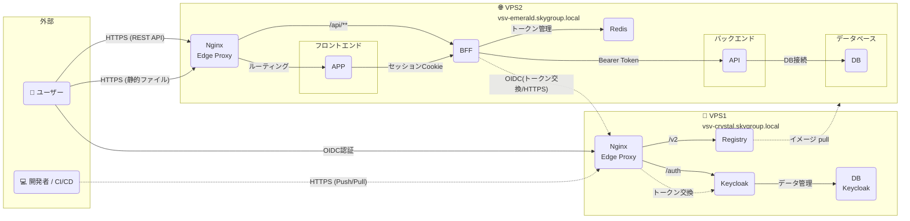
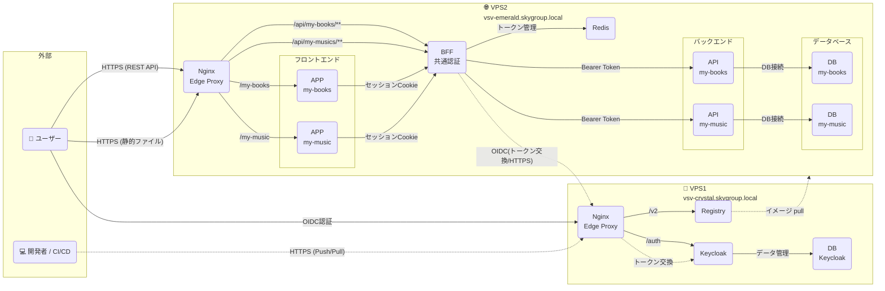
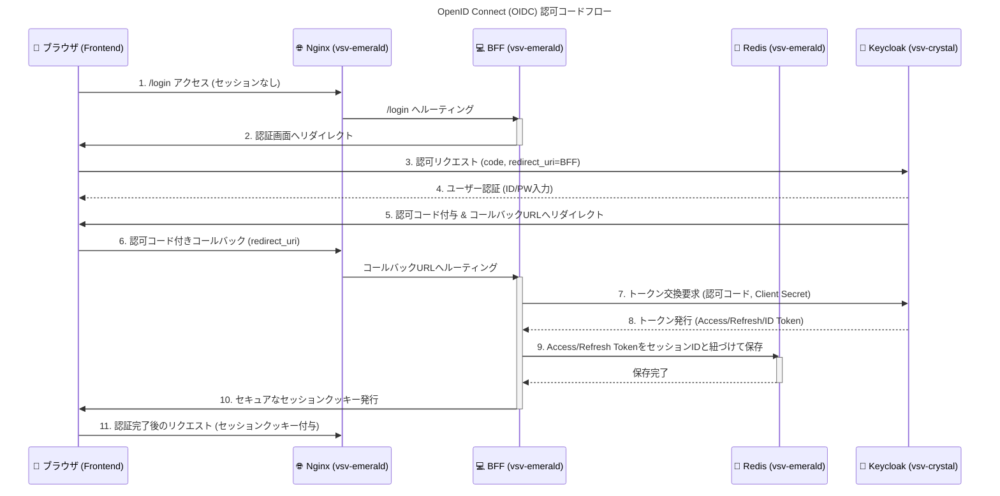
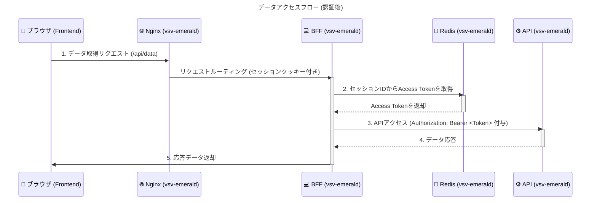
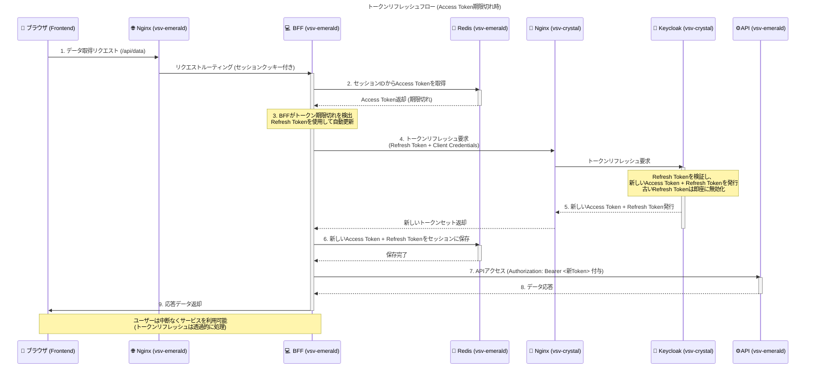

# 💻 Web アプリケーション構成概要 (VPS 2 台構成)

本システムは、機能分離とセキュリティ強化のため、役割の異なる **2 台の仮想プライベートサーバー (VPS)** を用いて構築されています。VPS1 は認証とイメージ管理、VPS2 はアプリケーション本体を実行します。

## 1. サーバー役割概要

| サーバー | ホスト名                     | 主な役割                                          | 接続方式               |
| :------- | :--------------------------- | :------------------------------------------------ | :--------------------- |
| **VPS1** | `vsv-crystal.skygroup.local` | **認証プロバイダー** および **Docker レジストリ** | **インターネット経由** |
| **VPS2** | `vsv-emerald.skygroup.local` | **Web アプリケーション本体** (実行環境)           | **インターネット経由** |

## 2. システムコンポーネント関係図

以下の図は、VPS1 と VPS2 の役割、内部コンポーネント、そして外部との依存関係を視覚的に示しています。

### 2-1. マルチアプリケーション構成例

複数の独立したアプリケーション（例: my-books、my-music）を同一の VPS2 上で稼働させる場合の構成図です。各アプリケーションは専用のバックエンドと DB を持ちますが、認証機能（BFF）と Redis は共通で利用します。

この構成により、以下のメリットが得られます：

- **認証基盤の統一**: 1 つの BFF で複数アプリの認証を一元管理
- **リソースの効率化**: Redis や BFF を共有することでリソース消費を削減
- **アプリケーションの独立性**: 各アプリは専用のバックエンドと DB を持つため、データとロジックが分離
- **スケーラビリティ**: アプリケーション単位での個別のスケーリングが可能

### 2-2. 実装上のプロジェクト名とコンテナ名

上記のアーキテクチャ図で示されたコンポーネントは、実際には以下のプロジェクト名とコンテナ名で実装されています。

#### VPS1 (vsv-crystal.skygroup.local)

| プロジェクト名 | 図中の表記 | コンテナ名    | 役割                                                               |
| -------------- | ---------- | ------------- | ------------------------------------------------------------------ |
| `vsv-crystal`  | Nginx      | `nginx-edge`  | エッジリバースプロキシ（HTTPS 終端、認証・レジストリルーティング） |
|                | Keycloak   | `keycloak`    | OIDC 認証プロバイダー                                              |
|                | DB         | `keycloak-db` | Keycloak 専用データベース                                          |
|                | Registry   | `registry`    | Docker イメージレジストリ                                          |

#### VPS2 (vsv-emerald.skygroup.local) - シングルアプリケーション構成

| プロジェクト名      | 図中の表記 | コンテナ名          | 役割                                                               |
| ------------------- | ---------- | ------------------- | ------------------------------------------------------------------ |
| `vsv-emerald`       | Nginx      | `nginx-edge`        | エッジリバースプロキシ（HTTPS 終端、アプリケーションルーティング） |
| `my-books-frontend` | APP        | `my-books-frontend` | フロントエンド（SPA）                                              |
| `my-books-api`      | API        | `my-books-api`      | リソースサーバー（REST API）                                       |
|                     | DB         | `my-books-db`       | アプリケーションデータベース                                       |
| `api-gateway-bff`   | BFF        | `api-gateway-bff`   | 認証ゲートウェイ・API プロキシ                                     |
|                     | Redis      | `redis`             | セッションストレージ（BFF トークン管理）                           |

## 3. VPS1: 認証・レジストリサーバー (`vsv-crystal.skygroup.local`)

インフラのコア機能、特に**認証認可**と**デプロイに必要なイメージ管理**を担います。

- **コンテナ構成**
  - **`nginx-edge`**: **エッジリバースプロキシ**。外部からの HTTPS/HTTP トラフィックを受け付ける**最前線の通信窓口**（ポート 80/443 を公開）。SSL 終端とルーティングを担当し、以下のエンドポイントを提供：
    - `/auth` → Keycloak（OIDC 認証）
    - `/v2` → Registry（Docker イメージの push/pull）
  - **`keycloak`**: **認証プロバイダー**。OpenID Connect (OIDC) プロトコルを提供。
  - **`keycloak-db`**: **Keycloak 専用のデータベース**。Keycloak が管理するユーザー情報、レルム設定、クライアント定義、セッション情報などを永続化するために利用されます。
  - **`registry`**: **Docker イメージレジストリ**。アプリケーションイメージの保管と配布。nginx-edge 経由でのみアクセス可能（内部ポート 5000）。

## 4. VPS2: Web アプリケーションサーバー (`vsv-emerald.skygroup.local`)

ユーザーに直接サービスを提供する、アプリケーションの実行環境です。

- **コンテナ構成**
  - **`nginx-edge`**: **エッジリバースプロキシ**。外部からの HTTPS/HTTP トラフィックを受け付ける**最前線の通信窓口**（ポート 80/443 を公開）。SSL 終端とルーティングを担当し、リクエストを `frontend` やその他の内部サービスへ転送します。
  - **`xxx-frontend`**: **ユーザーインターフェース (UI)** を提供する内部サービス。クライアント側での**セッション管理**を担当。
  - **`xxx-api`**: アプリケーションの**メインビジネスロジック**を実行する API サービス。BFF からの有効なアクセストークンでのみアクセスを許可します。
  - **`xxx-db`**: アプリケーションデータの**永続化**を行うデータベース。
  - **`api-gateway-bff` (Backend For Frontend)**:
    - **認証ゲートウェイ**。VPS1 Keycloak とのトークン交換を行い、**アクセストークンとリフレッシュトークンを管理**します。
    - Frontend からのリクエストを検証し、Backend へ転送する際の**Bearer トークン付与**を担当します。
  - **`redis`**: **BFF**が利用する**キャッシュ/データストア**。**アクセストークンとリフレッシュトークン**の保存・管理に使用されます。

## 5. 認証・データアクセスフロー（Keycloak と BFF 連携）

本システムは、OIDC 認可コードフローと BFF を必須とするデータアクセスにより、機密性の高いトークンをクライアントに露出させないセキュアな設計を採用しています。

### 5-1. ユーザー認証フロー (OIDC Code Flow)

Keycloak と BFF が連携し、BFF 内の Redis にトークンを保存してセッションを確立するまでの流れをシーケンス図で示します。

---

### 5-2. データアクセスフロー

認証完了後、Frontend からのデータ取得リクエストが BFF を経由し、Redis に保存されたトークンを用いて Backend へセキュアにアクセスする流れをシーケンス図で示します。

---

### 5-3. トークンリフレッシュフロー

Access Token の有効期限が切れた際、BFF が自動的に Refresh Token を使用して新しい Access Token を取得する流れをシーケンス図で示します。このプロセスは Spring Security OAuth2 Client が自動的に処理します。

**重要なポイント:**

- **自動処理**: Spring Security OAuth2 Client が`OAuth2AuthorizedClientRepository.loadAuthorizedClient()`実行時に自動的にトークン期限をチェックし、必要に応じてリフレッシュを実行
- **VPS 間通信の最小化**: Access Token が有効な間は VPS1（Keycloak）への通信は発生せず、期限切れ時のみ VPS 間通信が発生
- **透過的な処理**: フロントエンドはトークンリフレッシュを意識する必要がなく、通常の API リクエストと同様に処理される
- **セキュリティ**: Refresh Token は常に BFF の Redis 内に保持され、フロントエンドには一切公開されない
- **トークンローテーション**: Keycloak 設定（`refreshTokenMaxReuse: 0`）により、リフレッシュ時に新しい Refresh Token が発行され、古いトークンは即座に無効化される。これによりトークン漏洩時のリスクを最小化し、Replay 攻撃を防止
